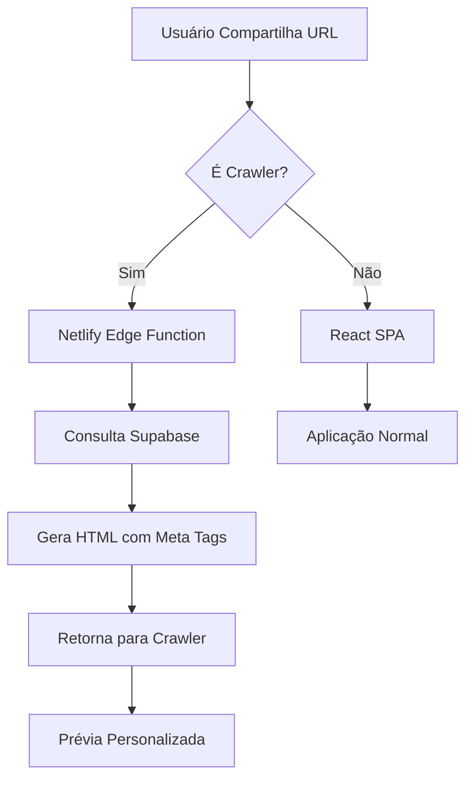

# Meta Tags Dinâmicas - VitrineTurbo

## Resumo Executivo

Sistema implementado para personalizar prévias de URL nas redes sociais (WhatsApp, Instagram, Facebook, Twitter) mostrando informações específicas de cada loja em vez de dados genéricos do VitrineTurbo.

## Problema vs Solução

| Antes | Depois |
|-------|--------|
| ❌ Prévia genérica "VitrineTurbo" | ✅ Nome específico da loja |
| ❌ Logo padrão do sistema | ✅ Avatar/logo do corretor |
| ❌ Descrição genérica | ✅ Bio personalizada da loja |
| ❌ Todas lojas parecem iguais | ✅ Cada loja com identidade própria |

## Exemplo Visual

### Antes (Genérico):
```
┌─────────────────────────────────┐
│ [Logo VitrineTurbo]             │
│                                 │
│ VitrineTurbo                    │
│ Sua Vitrine Digital             │
│                                 │
│ vitrineturbo.com/kingstore      │
└─────────────────────────────────┘
```

### Depois (Personalizado):
```
┌─────────────────────────────────┐
│ [Avatar King Store]             │
│                                 │
│ King Store - VitrineTurbo       │
│ Confira os melhores produtos... │
│                                 │
│ vitrineturbo.com/kingstore      │
└─────────────────────────────────┘
```

## Tecnologia Utilizada

### Stack
- **Netlify Edge Functions** (Deno runtime)
- **Supabase PostgreSQL** (consulta de dados)
- **Open Graph Protocol** (padrão de meta tags)
- **Twitter Cards** (compatibilidade Twitter/X)

### Por que Edge Functions?

1. **Zero impacto para usuários:** Só processa crawlers
2. **Performance:** Executa na borda (CDN) próximo ao usuário
3. **SEO-friendly:** Não afeta indexação
4. **Manutenção:** Sem servidor adicional necessário

## Arquitetura



## Crawlers Suportados

- ✅ Facebook (facebookexternalhit, Facebot)
- ✅ WhatsApp
- ✅ Instagram (usa crawler do Facebook)
- ✅ Twitter/X (Twitterbot)
- ✅ LinkedIn (LinkedInBot)
- ✅ Telegram (TelegramBot)
- ✅ Discord (Discordbot)
- ✅ Slack (Slackbot)
- ✅ Google (preview em resultados)
- ✅ Bing (preview em resultados)

## Estrutura de Arquivos

```
vitrineturbo/
├── netlify/
│   └── edge-functions/
│       └── meta-handler.ts          # Edge function principal
├── supabase/
│   └── functions/
│       └── meta-tags-handler/
│           └── index.ts              # Edge function alternativa
├── netlify.toml                      # Configuração Netlify
├── test-meta-tags.sh                 # Script de testes
├── SOCIAL_MEDIA_METATAGS.md         # Documentação técnica
├── QUICK_START_META_TAGS.md         # Guia rápido
├── EXAMPLE_META_RESPONSE.html       # Exemplo de resposta
└── META_TAGS_README.md              # Este arquivo
```

## Fluxo de Dados

### 1. Requisição Recebida
```
URL: https://vitrineturbo.com/kingstore
User-Agent: WhatsApp/2.0
```

### 2. Edge Function Detecta Crawler
```typescript
if (isCrawlerUserAgent(userAgent)) {
  // Processar
} else {
  // Passar para SPA
}
```

### 3. Extração do Slug
```typescript
const slug = url.pathname.split('/')[1]; // "kingstore"
```

### 4. Consulta ao Banco
```sql
SELECT name, slug, bio, avatar_url, cover_url_desktop, cover_url_mobile
FROM users
WHERE slug = 'kingstore'
LIMIT 1
```

### 5. Geração de HTML
```html
<meta property="og:title" content="King Store - VitrineTurbo" />
<meta property="og:description" content="Confira os melhores produtos..." />
<meta property="og:image" content="https://[avatar-url]" />
```

### 6. Resposta ao Crawler
```
HTTP/1.1 200 OK
Content-Type: text/html; charset=utf-8
Cache-Control: public, max-age=300, s-maxage=600

[HTML com meta tags]
```

## Meta Tags Geradas

### Open Graph (Facebook/WhatsApp)
```html
<meta property="og:type" content="profile" />
<meta property="og:url" content="[url-da-loja]" />
<meta property="og:title" content="[Nome] - VitrineTurbo" />
<meta property="og:description" content="[Bio do corretor]" />
<meta property="og:image" content="[Avatar URL]" />
<meta property="og:image:width" content="1200" />
<meta property="og:image:height" content="630" />
<meta property="og:site_name" content="VitrineTurbo" />
```

### Twitter Cards
```html
<meta name="twitter:card" content="summary_large_image" />
<meta name="twitter:title" content="[Nome] - VitrineTurbo" />
<meta name="twitter:description" content="[Bio do corretor]" />
<meta name="twitter:image" content="[Avatar URL]" />
```

## Performance & Cache

### Tempos de Resposta
- **Edge Function:** ~100-300ms
- **Consulta Supabase:** ~50-100ms
- **Total:** < 500ms

### Estratégia de Cache
```
Cache-Control: public, max-age=300, s-maxage=600
```

- **Navegador:** 5 minutos
- **CDN:** 10 minutos
- **Redes Sociais:** Variável (geralmente 24h)

### Invalidação de Cache

**Facebook:**
- Use Facebook Debugger: https://developers.facebook.com/tools/debug/
- Clique em "Scrape Again"

**WhatsApp:**
- Adicione `?v=2` no final da URL
- Ou aguarde 24h para expiração natural

**Twitter:**
- Use Twitter Card Validator: https://cards-dev.twitter.com/validator

## Manutenção

### Adicionar Novo Crawler

Edite `netlify/edge-functions/meta-handler.ts`:

```typescript
const crawlerPatterns = [
  // ... existing
  'NovoCrawlerBot', // Adicionar aqui
];
```

### Alterar Prioridade de Imagens

Edite a ordem em `generateMetaTagsHTML()`:

```typescript
const imageUrl = profile.avatar_url ||          // 1ª prioridade
                 profile.cover_url_desktop ||   // 2ª prioridade
                 profile.cover_url_mobile ||    // 3ª prioridade
                 'default-image-url';           // Fallback
```

### Atualizar Descrição Padrão

```typescript
const description = profile.bio ||
                   `Confira os produtos de ${profile.name}` || // Customizar aqui
                   'Descrição padrão';
```

## Testes

### Teste Rápido (1 min)
```bash
curl -A "WhatsApp/2.0" https://vitrineturbo.com/[slug] | grep "og:title"
```

### Teste Completo (5 min)
```bash
./test-meta-tags.sh https://vitrineturbo.com/[slug]
```

### Teste em Produção (10 min)
1. Facebook Debugger
2. Twitter Card Validator
3. WhatsApp real

## Monitoramento

### Métricas Importantes

| Métrica | Valor Ideal | Como Verificar |
|---------|-------------|----------------|
| Tempo de resposta | < 500ms | Logs Netlify |
| Taxa de erro | 0% | Logs Netlify |
| Cache hit rate | > 80% | Netlify Analytics |
| Crawlers detectados | ~5-10% | Logs customizados |

### Logs

**Netlify:**
```bash
netlify logs:function meta-handler --live
```

**Dashboard:**
Netlify Dashboard → Functions → meta-handler → Logs

## Segurança

### Considerações

1. **Dados públicos:** Apenas dados já públicos são expostos
2. **Rate limiting:** Netlify fornece proteção automática
3. **SQL Injection:** Protegido (usa Supabase client)
4. **XSS:** Sanitização automática em meta tags

### Privacidade

- ✅ Não coleta dados dos usuários
- ✅ Não rastreia visualizações
- ✅ Não armazena IPs
- ✅ Compatível com LGPD/GDPR

## FAQ

### P: Afeta SEO?
**R:** Não. A solução melhora SEO ao fornecer meta tags adequadas.

### P: Funciona em todos os navegadores?
**R:** Sim. Navegadores normais são redirecionados para a SPA.

### P: Qual o custo adicional?
**R:** Minimal. Netlify oferece 1M requests/mês grátis.

### P: Posso usar em outro hosting?
**R:** Sim. A Supabase Edge Function funciona independente do hosting.

### P: Como atualizar dados em tempo real?
**R:** Cache expira em 10 minutos. Force re-scraping nos debuggers.

### P: Funciona para páginas de produto?
**R:** Sim. Adicione lógica similar para detectar URLs de produto.

## Suporte

### Documentação
- **Técnica:** `SOCIAL_MEDIA_METATAGS.md`
- **Rápida:** `QUICK_START_META_TAGS.md`
- **Exemplo:** `EXAMPLE_META_RESPONSE.html`

### Ferramentas
- **Testes:** `./test-meta-tags.sh`
- **Debugger Facebook:** https://developers.facebook.com/tools/debug/
- **Validator Twitter:** https://cards-dev.twitter.com/validator

### Referências
- [Open Graph Protocol](https://ogp.me/)
- [Twitter Cards](https://developer.twitter.com/en/docs/twitter-for-websites/cards)
- [Netlify Edge Functions](https://docs.netlify.com/edge-functions/overview/)

## Changelog

### v1.0.0 (2025-10-05)
- ✅ Implementação inicial
- ✅ Suporte para Facebook/WhatsApp/Instagram
- ✅ Suporte para Twitter
- ✅ Edge function Netlify
- ✅ Edge function Supabase (backup)
- ✅ Script de testes
- ✅ Documentação completa

---

**Status:** ✅ Produção
**Manutenção:** Baixa
**Performance:** Alta
**ROI:** Alta visibilidade em compartilhamentos sociais
